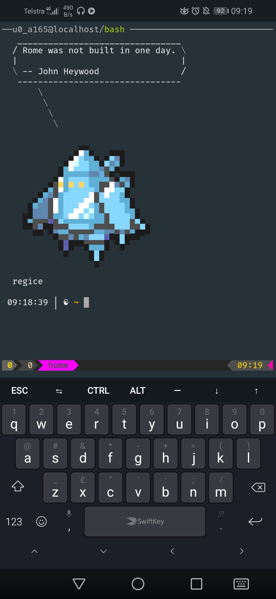

# pokesay

Performant-Pokémon!

`pokesay` is like [`cowsay`][cowsay] but for pokémon only. Internally, `pokesay` still uses `cowsay`, but supplies and organises its own Pokemon cowsay files for cowsay to use.

## Mission Statement

- [x] This must be run via Bash/shell scripts, and piggyback `cowsay`. Nobody wants to install weird dependencies to run this.
- [x] This must be as fast as possible.
- [x] There must be some nice options to control which pokemon you select

---




## Installation

The only dependency is BSD `cowsay`: https://www.freebsd.org/cgi/man.cgi?query=cowsay

This is available on most (all?) systems, and can be installed by commands like:

| OS | command |
|----|---------|
| debian | `apt install cowsay` |
| osx    | `brew install cowsay` |
| termux | `pkg install cowsay` |

### Installation via script

Running `./install.sh` will install `pokesay` in you homer folder, under `~/.pokesay/`.

An executable script will be created in `~/bin/pokesay`, so that you can have `pokesay` in your `$PATH` too.

It may be necessary to logout and login back again to have `pokesay` in your `$PATH`.

---

## Usage

* Now that you've installed `pokesay`, you can make it work like so:

    ```bash
    $ pokesay Hello World
    ```

* To have a random Pokémon say a random message, try using with `fortune`:

    ```bash
    $ fortune | pokesay
    ```

* If you really like it, you can add the command above to the end of your `~/.bashrc` file (or equivalent). So you will have a random pokémon speaking to you whenever you open a new terminal window! :D

* Pick a pokemon this is in the `'shiny'` category AND contains the substring `'chu'`

    ```bash
    pokesay -c shiny -p chu 'yo'
    ```

## Development

If you want to rebuild (and install) everything in the repository, you will need to run the Makefile command

```
make build install
```

This will produce a `cows/` directory which will contain all of the sprites from pokesprite, transformed from PNG to cowfile, ready for use.

## NOTICE

Please notice I don't own Pokémon or anything related to it. Pokémon is property of [The Pokémon Company][the-pokemon-company].

* [pokesay]: https://github.com/possatti/pokemonsay
* [img2xterm]: https://github.com/rossy/img2xterm
* [cowsay]: https://en.wikipedia.org/wiki/Cowsay
* [the-pokemon-company]: https://en.wikipedia.org/wiki/The_Pok%C3%A9mon_Company

