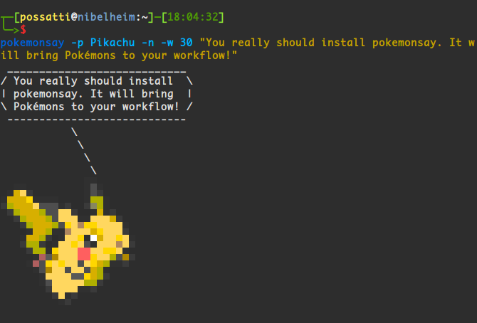

# ppokemonsay

Performant-Pokémon!


==========



`pokemonsay` is like [`cowsay`][cowsay] but for pokémon only. It was inspired by [`ponysay`][ponysay] (`cowsay` for ponies). Internally, `pokemonsay` still uses `cowsay`, so you need it installed too (`cowsay`... not `ponysay`).

## Installation

The only dependency is BSD `cowsay`: https://www.freebsd.org/cgi/man.cgi?query=cowsay

This is available on most (all?) systems, and can be installed by commands like:

| OS | command |
|----|---------|
| debian | `apt install cowsay` |
| osx    | `brew tap possatti/possatti && brew install cowsay` |
| termux | `pkg install cowsay` |
| linux | `git clone http://github.com/possatti/pokemonsay && cd pokemonsay && ./install.sh` |

### Installation via script

Running `./install.sh` will install `pokemonsay` in you homer folder, under `~/.pokemonsay/`.

An executable script will be created in `~/bin/pokemonsay`, so that you can have `pokemonsay` in your `$PATH` too.

It may be necessary to logout and login back again to have `pokemonsay` in your `$PATH`.

## Usage

Now that you've installed `pokemonsay`, you can make it work like so:

```bash
$ pokemonsay Hello World
```

To have a random Pokémon say a random message, try using with `fortune`:

```bash
$ fortune | pokemonsay
```

And if you really like it, you can add the command above to the end of your `~/.bashrc` file (or equivalent). So you will have a random pokémon speaking to you whenever you open a new terminal window! :D

You get a cowthink-like version too. Try it:

```bash
$ pokemonthink --pokemon Charmander "Should I wear some clothes?"
```

## Uninstall

Just in case you hate Pokémon and you've installed `pokemonsay` "by mistake"... 
Humpf! You can uninstall it by running:

```bash
$ sh $HOME/.pokemonsay/uninstall.sh
```


And there it is. Now install it with `install.sh` and you are done.

## Development

If you want to rebuild everything in the repository, you will also need 
[`img2xterm`][img2xterm], which is used to generate ".cow files" from the pokémon 
images.


## NOTICE

Please notice I don't own Pokémon or anything related to it. Pokémon is property 
of [The Pokémon Company][the-pokemon-company].

[pokemonsay]: https://github.com/possatti/pokemonsay
[img2xterm]: https://github.com/rossy/img2xterm
[cowsay]: https://en.wikipedia.org/wiki/Cowsay
[the-pokemon-company]: https://en.wikipedia.org/wiki/The_Pok%C3%A9mon_Company

